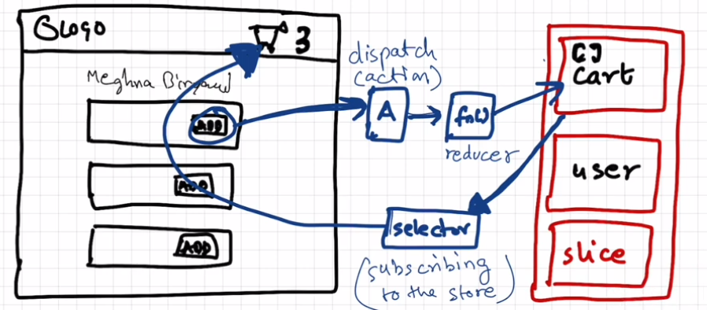

# Redux

- Redux is not manadatory to use
- Large scale applications where the data is heavily used, lot of read and write operations are going on then using redux will make sense
- Appluications become easier to debug
- All applications built with redux can also be built without redux
- Redux is not a part of react . Both are two different libraries
- Other libraies to manage state except redux are
  - zustand (Gaining popularity)

## What is redux

A predictable state container for JS apps

Redux

- React-redux
- Redux Toolkit(**RTK**)

**Not using vanilla redux here**

- Redux-store is like a very big js object kept in a global central space
- A slice is like a small portion of the redux store which are basically a logical partion to keep the data of different type seprated from one another. Example:
  - CartSlice : to store the data for the cart
  - UserSlice : to store the info of the logged in user
- Our store do have multiple slices inside them
- We can't direclty modify a slice

**Lets say we are bulding an cart slice**

### Way to Write data inside the slice

- We click on the `Add` button
- It `dispaches` an `action`
- Calls an function`Reducer`
- `Reducer` Updates the cartSlice by internally modifing the cartSlice

### Way to Read data inside the slice

- `Selector` reads the data from the slice and will modify our frontend/react-component.
- The frontend component will be subscribed to the store
- `Subscribing to the store` means  to be getting in sync with the store 



### Steps we are going to follow in dev

- Installation
- Build out store
- Connect our store to the app
- Slice(cartSlice)
- Dispatch action
- Selector


## Code Part

### Installation

installation of @reduxjs/toolkit and react-redux

```bash
# redux-toolkit installation
npm i @reduxjs/toolkit

#react-redux installation
npm i react-redux
```

### Creation of store

```js

```

### Creation of slice

**Remember the syntax**
`cartSlice.js`

```js
import { createSlice, isAction } from "@reduxjs/toolkit";
//CreateSlice takes an confiouration to create an slice
/*
First configuration => name
Second configuration => initialstate (What basically should initially be cart items)
Third configuration => reducers (Object) (Reducer functions are passed here)
Actions are like apis to communicate with the store.
Reducer functions gets two parameters => one is State, another is action. It will modify the  state based on the action
*/
const cartSlice = createSlice({
    name : "cart",
    initialState : {
        items : []
    },
    reducers: {
        // addItems is an action 
        // and an reducer function is mapped to it. It will be used to modify the cart
        addItems : (state, action) => {
            state.items.push(action.payload)
        }, 

        // as we dont need action , therefore we can simply remove that from the below 
        removeItems : (state) => {
            // Lets say we are removing the last item only from the cart's items array
            state.items.pop();
        },
        clearCart : (state) => {
            state.items.length = 0;

            
        }
    }
});
/* 
createSlice returns an object that will be stored in the cartSlice and the object will look likew this
{
    action : {
        addItems: (  ),
        removeItems: (),
        clearcart: ()
    }, 
    reducer
}
*/
export const {addItems, removeItems, clearCart} = cartSlice.actions;
export default cartSlice.reducer;
```

**Note that state = [] wont work in clearCart function because we are not mutating the state, we are just updaing the reference**
or i may say ki state ek pointer thaa jo point kr rha thaa localVar ko, abb humne uss pointer ko ek nayi array pr hi point kra diya inplace of modifying the original local var
**Or we may evern `return {items : []}`**

### Providing the store to the app

```js
import { Provider } from "react-redux";
import appStore from "./utils/appStore";
const AppLayoutComponent = () => {
    return (
        <Provider store={appStore}> 
        {/* Provider takes the store as an props*/}
            <div className="app">
                <HeaderComponent />

                <Outlet/>

                {/* <FooterComponent/> */}
            </div>
        </Provider>
    )
}
```

If we want to provide the store to some part of the app, then we can also do the same, bu wrapping only that particular component inside the provider (Similar to done in using `context-provider`)

### Subscribing to a selector

`Header.js`

```js
import { useSelector } from "react-redux/es/hooks/useSelector";
const HeaderComponent = () => {
    //The below hook will give us access to the store
    //Subscribing to thestore using an selector
    const cartItems =  useSelector((store) =>{
        //I want access to only cart part therefore i will write
        return store.cart.items
    })
    return (
        <div>
          <span className="">
              Cart({cartItems.length} items)
          </span>
        </div>
    );
};

export default HeaderComponent;
```

### useDispatch

```js
import { useDispatch } from "react-redux";
import { addItems } from "../utils/Slices/cartSlice";
const ItemList = ({ items, dummy }) => {
  const dispatch = useDispatch();
  
  const handleAddItem = () => {
      //Wanna dispatch an action
      //suppose i pass pizza as an arguement to the AddItems , then the pizza will get as an payload.
      dispatch(addItems("pizza"))
      /*
        Now, the redux creat an object
        {
          payload : "pizza"
        }
      */
  }
  return (
    <div>
      {items.map((item) => (        
              <button
                className="p-2 mx-16 rounded-lg bg-black text-white shadow-lg"
                onClick={() => handleAddItem(item)}
              >
                Add +
              </button>
      ))}
    </div>
  );
};
```

## Important

**Way to do onclick is as follow**

```js
onclick( () => functionToBeCalled(Arguements))
```

not this

```js
onclick(functionToBeCalled(Arguements))
```

as In the first case, when you use `onClick={handleAddItem(item)}`, you are actually invoking the `handleAddItem` function immediately during the rendering phase, not when the button is clicked. This is because the parentheses `()` after `handleAddItem(item)` trigger the function call right away.

Let's break down why this happens:

```jsx
<button onClick={handleAddItem(item)}>Click me</button>
```

In this code, `handleAddItem(item)` is executed immediately during the rendering phase, and the result (presumably `undefined` or whatever the function returns) is assigned to the `onClick` handler. This is not the intended behavior for event handlers in React.

To avoid this, you can use an arrow function to create a function that will be called only when the button is clicked:

```jsx
<button onClick={() => handleAddItem(item)}>Click me</button>
```

Here, the arrow function `() => handleAddItem(item)` is assigned to the `onClick` handler. The function is not invoked immediately; instead, it is executed only when the button is clicked. This is a common pattern in React when you need to pass parameters to an event handler.

## Important Points

- While using a `selector` make sure that you are subscribing to the right portion of the store.
  - This will improve the performance by a lot
  - 
- `reducer` in appStore.js , `reducers` in cartStore.js
- In vanilla/older redux , you are not allowed to mutate the state
  - The code looks like this
    - `Earlier`
      - returning was manadatory
      - addItem: (state, action) => {
      const newState = [...state];
      newState.items.push(action.payload);
      return newState;
    }
    - `Present` 
      - Presently, we have to either mutate the state in redux Toolkit, or return a new state. The return value will replace whatyever was present in the original state
      - Redux is till doing all the earlier work , but now in the background
      - uses `immer` library to do that. Find the difference between older state, new state.
      - addItem : (state, action) => state.items.push(action.payload);
- `console.log(state)` wont work in redux, we have to do `console.log(current(state))`

## Redux Dev Tools chrome extention

- used for debugging
